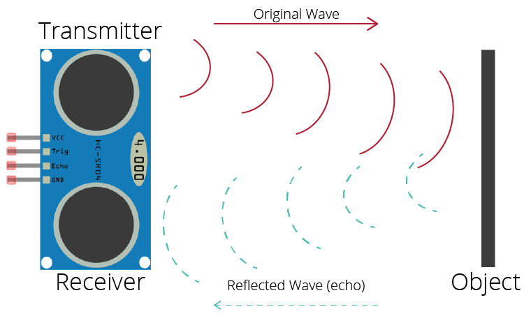
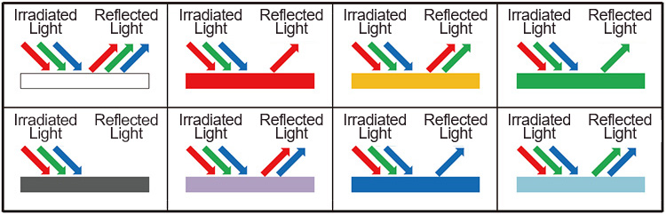
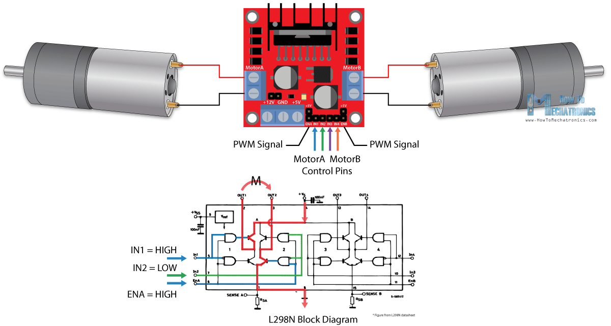
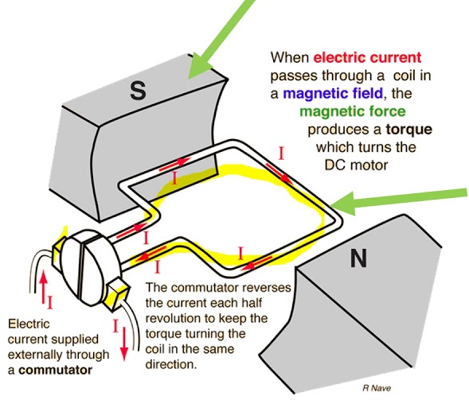
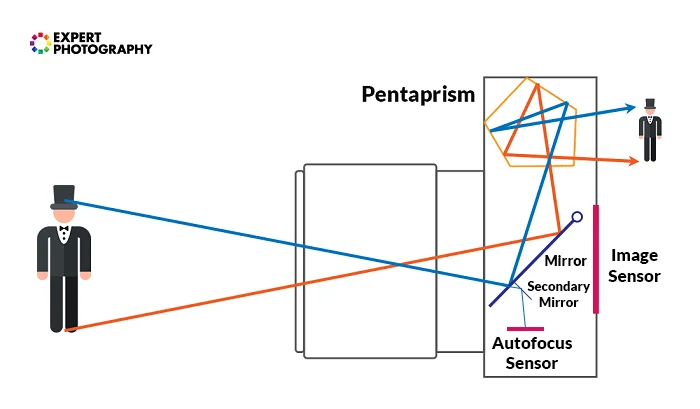

<h1> 34 Palestine Team </h1>
 
<h2><b> The Car Body </b></h2>
 

 
A rear-wheel <b><u>Drive motor</u> </b>and another motor were used to control the direction of the children's toy car, and they were connected to the <b>  <u> L298n</u> </b> to control the speed and direction of movement, and the L298n was connected to the  <b> <u>Raspberry pi 4 (16GB) </u> </b> microcontroller to be able to give programming commands to it, and the  L298n  and <b> <u>DC Motors </u></b> were powered By connecting it to <b> <u>six batteries</u></b> , each battery <b> 1.5V</b>, so that the total power inside it is <b>9V</b>, and the distance sensor <b> <u> (Ultrasonic sensor) </u> </b>was connected with the controller (Raspberry pi4) to provide it with the distance inside the circuit, and the<b><u> Camera of  Raspberry pi</u></b> was connected under the car with the Raspberry pi controller to identify the color of the line The first located on the circuit to determine the direction of the car’s path if it is blue, gives a software signal to direct the car’s rotation movement counterclockwise,If the color is orange, the car will turn around the circuit clockwise, and the <b><u>USB Camera </u></b>with Raspberry pi 4 is connected perpendicular to the car to identify the traffic lights placed on the second circuit track and give software signals to avoid collision with traffic lights and temporarily change the free direction of the car to the right if there is The traffic light is red and left if it is green, and the Raspberry pi 4 controller is equipped with a card derived from a <b> <u>5V Powerbank </u> </b>attached to the car chassis.
 

  

 
<h2><b> Sensors And Car Parts Mechanism </b></h2>
 
 
<h3><b> Ultrasonic Sensor: </b></h3>

The Ultrasonic sensor returns a program value that carries the value of the distance, which is measured by sending the Ultrasonic sensor ultrasonic waves until these waves hit the nearest barrier and these waves return to the Ultrasonic sensor and calculate the time and speed and multiply them to get the value of the distance back and forth, to take the correct value we divide The resulting number over 2.

 

 
  
 
 
<h3><b>Color Sensor: </b></h3>

When white light falls on any surface, some wavelengths of light are absorbed and some of them are reflected depending on the properties of the surface material, and the color we see is the result of the reflection of the remaining wavelengths. White on the body that absorbs all wavelengths except for its color, which is reflected from it, then the diodes array absorbs the reflected rays and generates a current proportional to the intensity of the light، Finally, the transformer converts the current into a square signal (50% modulation) at a frequency.
Directly proportional to the intensity of the light.

 

 
 
 
 
<h3><b>L298n:</b></h3>

In order to have complete control of the DC motor, we have to control its direction and rotation. This can be achieved by combining these two methods.
PWM - to control the speed.
H-Bridge - To control the direction of rotation. The speed of the DC motor can be controlled by changing the input voltage. A common approach to doing this is to use PWM (Pulse Width Modulation)
The direction of rotation of the DC motor can be controlled by changing the polarity of the input voltage. A common way to do this is to use H-Bridge.

 

 
 
 
 
<h3><b>DC Motors:</b></h3>

The motor works on the principle of Lorentz force, which says: “Any conductor in which an electric current flows and is located in an external magnetic field is acted upon by a force, and the direction of the force is perpendicular to both the direction of the magnetic field and the direction of the electric current.”

 

 
 
 
 
<h3><b>Camera:</b></h3>

The camera works on capturing images continuously and the images consist of pixels, each pixel carrying only one color. These images taken by the camera are sent to the Raspberry Pi to be analyzed based on the computer Vision, so that the Raspberry, with the help of the open cv library that works in the field of computer vision, recognizes the pixels Which carries the color in our color range, then separates it by itself and makes a masking for it to be used in the rest of the code.

 

